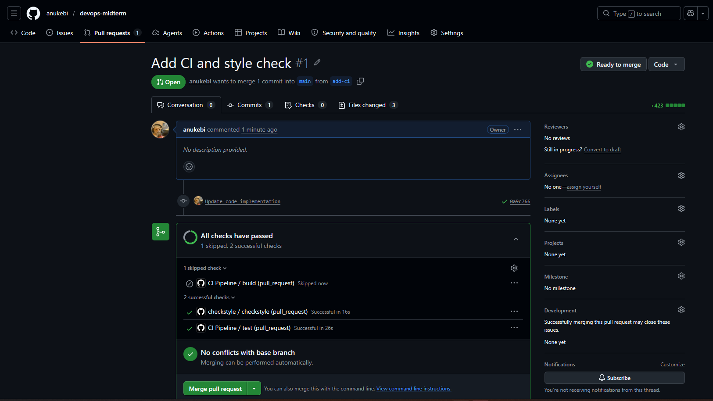
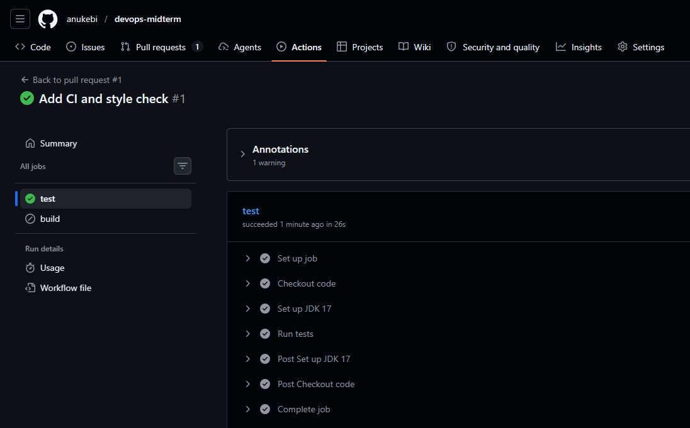
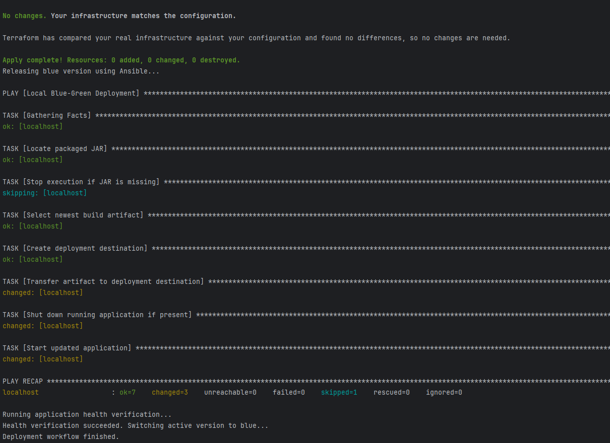
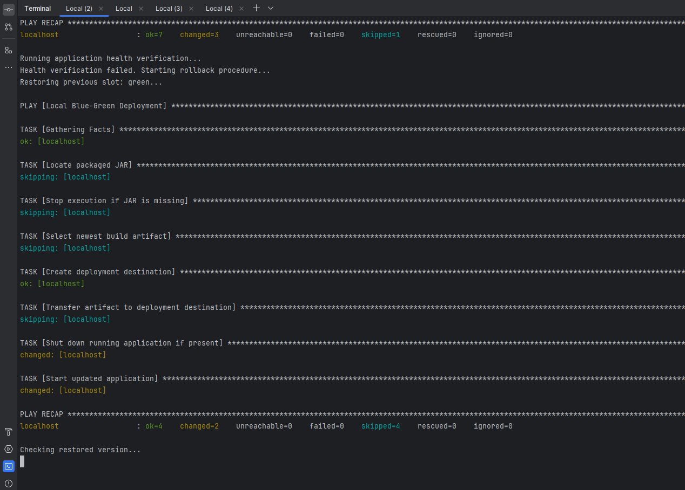
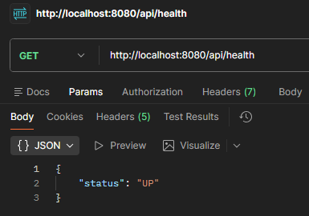
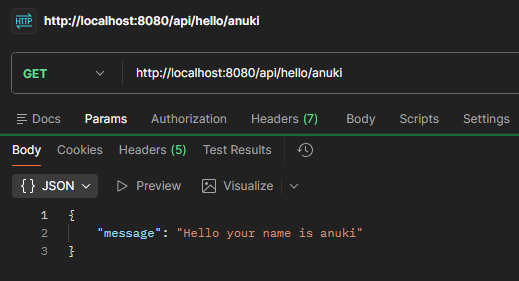
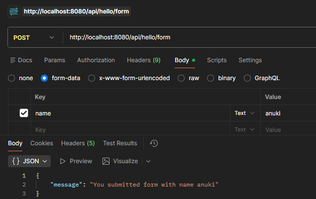
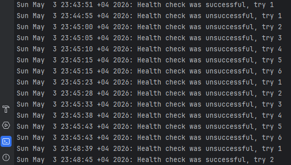
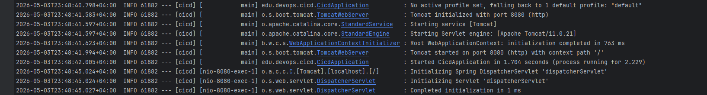

# Midterm Project


## 1. Description
This is a simple Java project built with Spring Boot exposing a few HTTP endpoints to set up and demonstrate a basic CI/CD pipeline.
It contains a single controller with GET and POST endpoints accepting and returning strings, plus a health endpoint used by the deployment pipeline, and a test class to validate the controller.


## 2. Tools
- Java 21
- Spring Boot
- Maven (via `mvnw` wrapper)
- Checkstyle
- GitHub Actions
- Terraform
- Ansible
- WSL2


## 3. IaC Configuration
Configuration files for the CI/CD pipeline are located in the `.github/workflows` and `pipeline` folders. In order to run the pipeline,
certain environment variables need to be set. WSL2 should have your Windows drive mounted by default; if not, please mount it beforehand
so you can access your project files via the `/mnt/c/...` path. Additionally, an environment file should be created at `~/devops/env`
inside the WSL2 environment with the following content:
```bash
export PROJECT_DIRECTORY=/mnt/c/PATH_TO_PROJECT # replace with your project path to access it from WSL2
export DEPLOYMENT_DIRECTORY=/home/YOUR_USER/midterm/deployment
export DEPLOYMENT_COLOR=blue
export PORT=8080
```

### 3.1. GitHub Actions
Two workflows are defined under `.github/workflows`:

- **`ci.yml`** — triggered on every push and pull request to the `main` and `dev` branches. It sets up JDK 21 (Temurin) and runs `mvn test -Dcheckstyle.skip`. On pushes to `main`, a follow-up `build` job runs `mvn package -DskipTests -Dcheckstyle.skip` to produce the JAR artifact.
- **`checkstyle.yml`** — triggered on every pull request. It uses `dbelyaev/action-checkstyle` to annotate the PR with any Checkstyle violations, using the repository's `GITHUB_TOKEN`.

### 3.2. Terraform
Terraform is used to provision the local deployment infrastructure inside WSL2. The `pipeline/terraform/main.tf` file declares a `deployment_directory` variable (passed in from the deploy script) and creates three folders via a `null_resource` with a `local-exec` provisioner:
- `deployment-blue` and `deployment-green` — used for the blue-green deployment strategy.
- `deployment-current` — used as a pointer (symlink target) to the most recently deployed, healthy application version.

A `find ... tr -d "\r"` command is included to strip any Windows-style carriage returns from generated directory names.

### 3.3. Ansible
Ansible deploys the built application to the provisioned infrastructure. The `pipeline/ansible/deploy.yml` playbook runs against `localhost` (see `pipeline/ansible/hosts`) and:
1. Locates the newest JAR under `target/` (skipped on rollback via `skip_build`).
2. Ensures the `deployment-{{ color }}` destination directory exists.
3. Copies the JAR to that directory as `midterm.jar`.
4. Stops any currently running `midterm.jar` process.
5. Starts the new application in the background with `nohup java -jar midterm.jar > output.log 2>&1 &`.


## 4. CI/CD Pipeline

### CI
The CI pipeline is configured entirely in GitHub Actions (`ci.yml` and `checkstyle.yml`). It runs tests on every push and pull request to `main` and `dev`, runs Checkstyle on every pull request, and packages the JAR on pushes to `main`.

### CD
The CD pipeline is driven by `pipeline/deploy.sh`, executed from a WSL2 terminal:
```bash
bash $PROJECT_DIRECTORY/pipeline/deploy.sh
```
To toggle between deployment slots, change the `DEPLOYMENT_COLOR` variable in `~/devops/env` to `blue` or `green`.

The script sources environment variables from `~/devops/env`, validates that `PROJECT_DIRECTORY`, `DEPLOYMENT_DIRECTORY`, `DEPLOYMENT_COLOR`, and `PORT` are set, and that the color is either `blue` or `green`. Then it executes the pipeline:

1. Builds the project with `./mvnw clean package -DskipTests` to produce the JAR without re-running CI steps.
2. Runs `terraform init`, `validate`, `plan`, and `apply -auto-approve` inside `pipeline/terraform`, passing `-var="deployment_directory=$DEPLOYMENT_DIRECTORY"` to provision the `deployment-blue`, `deployment-green`, and `deployment-current` folders.
3. Runs `ansible-playbook pipeline/ansible/deploy.yml -i pipeline/ansible/hosts --extra-vars "color=$DEPLOYMENT_COLOR project_directory=$PROJECT_DIRECTORY"` to deploy the JAR into the selected color slot and start it.
4. Executes `pipeline/healthcheck.sh`, which polls `http://localhost:$PORT/api/health` up to 5 times with a 5-second interval, logging results to `$DEPLOYMENT_DIRECTORY/health-check.log`. A 200 response marks the deployment healthy.
5. On success, updates the `deployment-current` symlink to point at `deployment-$DEPLOYMENT_COLOR`.
6. On failure, rolls back by redeploying the opposite color via Ansible (with `skip_build=true`), re-runs the health check, and restores the `deployment-current` symlink to the previous slot. If the rollback also fails, the script exits non-zero and manual intervention is required.

All health check and application logs can be found in the deployment directory. Application logs are written to `deployment-blue/output.log` and `deployment-green/output.log`, while health check results are appended to `health-check.log`.

## 5. Screenshots
### 1. GitHub Actions CI test passed after pushing to dev branch and creating PR


### 2. GitHub Actions CI workflow steps


### 3. Successful deployment


### 4. Failed deployment with rollback


### 5. Application running




### 6. Healthcheck logs


### 7. Application logs
