# DevOps Final Project

A Spring Boot application with full CI/CD automation, blue-green deployment, observability stack, security scanning, and
production-readiness improvements built throughout the semester.

This project extends the previously submitted midterm and CI/CD assignments. All earlier functionality remains
operational.

## Requirements Compliance

The table below maps each final-project requirement from the assignment to its implementation in this repository.

| Requirement                  | Status | Implementation                                                                              |
|------------------------------|--------|---------------------------------------------------------------------------------------------|
| **Branching Strategy**       | Done   | `main` (production) and `dev` (integration) - see [Branching Strategy](#branching-strategy) |
| **Continuous Integration**   | Done   | `.github/workflows/ci.yml`, `.github/workflows/checkstyle.yml`                              |
| **Continuous Deployment**    | Done   | `pipeline/deploy.sh` with Terraform + Ansible blue-green deployment                         |
| **Infrastructure as Code**   | Done   | `pipeline/terraform/main.tf`, `pipeline/ansible/deploy.yml`                                 |
| **Docker / Docker Compose**  | Done   | `Dockerfile`, `docker-compose.yml`                                                          |
| **Monitoring**               | Done   | Prometheus + Grafana dashboards in `monitoring/`                                            |
| **Logging**                  | Done   | JSON logging via Log4j2, ELK stack in Docker Compose                                        |
| **Observability**            | Done   | Metrics, logs, dashboards, and architecture diagram                                         |
| **Alerting**                 | Done   | Prometheus rules + Grafana provisioned alerts                                               |
| **Health Checks**            | Done   | `/api/health`, `pipeline/healthcheck.sh`, Docker healthcheck                                |
| **Environment Automation**   | Done   | `scripts/setup.sh` - single-command setup                                                   |
| **Security Automation**      | Done   | OWASP, Trivy, Gitleaks, Hadolint, tfsec in CI                                               |
| **Reliability Improvements** | Done   | Rollback, SLOs, incident response, alerting                                                 |
| **Automation Improvements**  | Done   | Multi-stage CI, env validation, post-deploy checks                                          |
| **Documentation**            | Done   | This README, `docs/SLO.md`, `docs/INCIDENT_RESPONSE.md`                                     |
| **Local Execution**          | Done   | No paid cloud services required - runs locally via Docker Compose and WSL/Linux scripts     |

## Branching Strategy

| Branch | Purpose                         | CI Behavior                                                             |
|--------|---------------------------------|-------------------------------------------------------------------------|
| `dev`  | Feature integration and testing | Runs tests and security scans on push/PR                                |
| `main` | Stable production-ready code    | Runs full pipeline: test -> security -> build -> post-deploy validation |

Workflow:

1. Create a feature branch from `dev`
2. Open a pull request into `dev` - triggers tests and Checkstyle annotations
3. Merge to `dev` for integration testing
4. Open a pull request from `dev` to `main` - full validation before release
5. Merge to `main` - triggers JAR build, Docker image scan, and artifact upload

## Local Execution

All functionality runs locally without paid cloud services or commercial subscriptions:

- **Application + observability:** `bash scripts/setup.sh` or `docker compose up -d --build`
- **CI checks locally:** `./mvnw test`, `mvn checkstyle:check`
- **Blue-green deployment:** `bash pipeline/deploy.sh` (requires Terraform, Ansible, WSL2 or Linux)
- **Security scans:** documented in [Security Implementation](#security-implementation)

Only free and publicly available tools are used (GitHub Actions free tier, open-source scanners, Docker images).

## Project Architecture

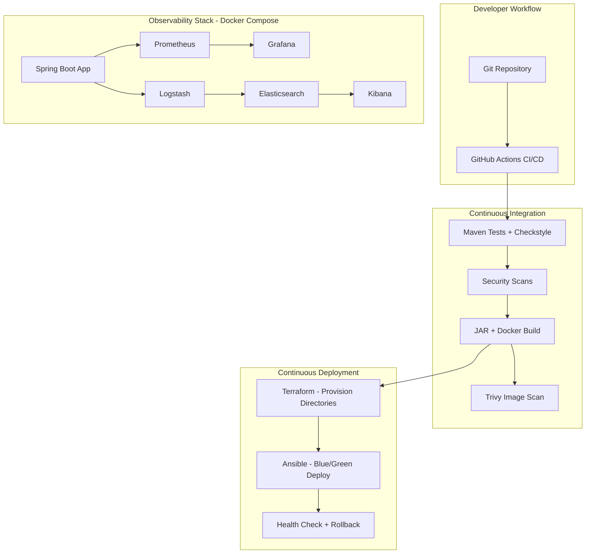
```mermaid
flowchart TB
    subgraph dev["Developer Workflow"]
        Git[Git Repository]
        GHA[GitHub Actions CI/CD]
    end

    subgraph ci["Continuous Integration"]
        Test[Maven Tests + Checkstyle]
        Sec[Security Scans]
        Build[JAR + Docker Build]
        Trivy[Trivy Image Scan]
    end

    subgraph cd["Continuous Deployment"]
        TF[Terraform - Provision Directories]
        Ansible[Ansible - Blue/Green Deploy]
        HC[Health Check + Rollback]
    end

    subgraph obs["Observability Stack - Docker Compose"]
        App[Spring Boot App]
        Prom[Prometheus]
        Graf[Grafana]
        ES[Elasticsearch]
        LS[Logstash]
        KB[Kibana]
    end

    Git --> GHA
    GHA --> Test --> Sec --> Build --> Trivy
    Build --> TF --> Ansible --> HC
    App --> Prom --> Graf
    App --> LS --> ES --> KB
```

## Tools

- Java 21, Spring Boot, Maven
- Git, GitHub Actions
- Terraform, Ansible (blue-green deployment)
- Docker, Docker Compose
- Prometheus, Grafana, Elasticsearch, Logstash, Kibana
- Security: OWASP Dependency-Check, Trivy, Gitleaks, Hadolint, tfsec

## Quick Start - Single Command Setup

Start the full local environment (application + observability stack):

```bash
bash scripts/setup.sh
```

This script:

1. Creates `~/devops/env` from the template if it does not exist (for WSL/Linux blue-green deployment)
2. Builds and starts all services via Docker Compose

Other options:

```bash
bash scripts/setup.sh --docker-only   # Start only Docker Compose stack
bash scripts/setup.sh --deploy-env    # Create only the deployment env file
bash scripts/validate-environment.sh  # Verify all required files and tools
```

### Service URLs (Docker Compose)

| Service       | URL                   | Login         |
|---------------|-----------------------|---------------|
| Application   | http://localhost:8080 | -             |
| Prometheus    | http://localhost:9090 | -             |
| Grafana       | http://localhost:3000 | admin / admin |
| Kibana        | http://localhost:5601 | -             |
| Node Exporter | http://localhost:9100 | -             |

### Local Development (without Docker)

```bash
./mvnw test
./mvnw spring-boot:run
```

## Environment Setup

### Docker / Observability Stack

```bash
docker compose up -d --build
```

On startup, the `kibana-setup` container creates the **Application Logs** data view. If Kibana Discover is empty, call
`curl http://localhost:8080/api/hello/World` and refresh.

### WSL2 Blue-Green Deployment

For the Ansible/Terraform deployment pipeline, create the environment file (or run
`bash scripts/setup.sh --deploy-env`):

`~/devops/env`:

```bash
export PROJECT_DIRECTORY=/mnt/c/PATH_TO_PROJECT
export DEPLOYMENT_DIRECTORY=/home/YOUR_USER/midterm/deployment
export DEPLOYMENT_COLOR=blue
export PORT=8080
```

Deploy:

```bash
bash $PROJECT_DIRECTORY/pipeline/deploy.sh
```

Toggle between `blue` and `green` by changing `DEPLOYMENT_COLOR` in `~/devops/env`.

## Deployment Workflow

### CI (GitHub Actions)

Workflow: `.github/workflows/ci.yml`

| Stage                      | Trigger                  | Actions                                                             |
|----------------------------|--------------------------|---------------------------------------------------------------------|
| **test**                   | Push/PR to `main`, `dev` | Maven unit tests                                                    |
| **security**               | After tests pass         | Checkstyle, Gitleaks, tfsec, Hadolint, OWASP Dependency-Check       |
| **build**                  | Push to `main`           | Package JAR, build Docker image, Trivy scan                         |
| **post-deploy-validation** | Push to `main`           | Validate Docker Compose, environment scripts, and project structure |

PR checkstyle annotations: `.github/workflows/checkstyle.yml`

After a successful blue-green deployment, `scripts/post-deploy-check.sh` verifies API endpoints automatically.

### CD (Blue-Green)

`pipeline/deploy.sh` executes:

1. Maven build (`./mvnw clean package -DskipTests`)
2. Terraform init/validate/plan/apply - provisions `deployment-blue`, `deployment-green`, `deployment-current`
3. Ansible deploys JAR to the selected color slot
4. Health check polls `http://localhost:$PORT/api/health` (5 retries, 5s interval)
5. On success: updates `deployment-current` symlink
6. On failure: automatic rollback to the opposite slot, re-health-check, restore symlink
7. On success: `scripts/post-deploy-check.sh` verifies `/api/hello/World`, `/metrics`, `/actuator/prometheus`, and
   `/api/error`

## Security Implementation

Security checks are integrated into the CI pipeline:

| Tool                       | Target                | Purpose                                  |
|----------------------------|-----------------------|------------------------------------------|
| **OWASP Dependency-Check** | Maven dependencies    | Dependency vulnerability scanning        |
| **Trivy**                  | Docker image          | Container image scanning (CRITICAL/HIGH) |
| **Gitleaks**               | Git repository        | Secrets scanning                         |
| **Hadolint**               | `Dockerfile`          | Dockerfile best-practice validation      |
| **tfsec**                  | `pipeline/terraform/` | Infrastructure as Code security          |
| **Checkstyle**             | Java source           | Code quality and style enforcement       |

### Secrets Management

Secrets are kept out of the repository:

- Deployment configuration is stored in `~/devops/env` (generated from `scripts/env.template`)
- `.env` files are listed in `.gitignore`
- **Gitleaks** scans every CI run for accidentally committed credentials
- Optional GitHub secrets (`NVD_API_KEY`) are used only in CI, never committed

Run security scans locally:

```bash
mvn checkstyle:check
mvn org.owasp:dependency-check-maven:check -Dcheckstyle.skip
docker build -t midterm-app:local . && docker run --rm aquasec/trivy image midterm-app:local
```

Optional: set `NVD_API_KEY` GitHub secret for faster OWASP Dependency-Check NVD database updates.

## Monitoring, Logging, and Alerting

### Metrics

Custom counters in `AppMetrics`:

- `app_requests_total` - incremented on API requests
- `app_errors_total` - incremented on `/api/error`

Exposed via:

- `GET /metrics` - custom Prometheus text format
- `GET /actuator/prometheus` - scraped by Prometheus for Grafana dashboards

### Logging (ELK)

JSON structured logging via Log4j2. In Docker mode, logs are shipped to Logstash (TCP port 5000), indexed in
Elasticsearch, and viewed in Kibana.

Kibana: filter with `level: ERROR` to see error lines.

### Alerting

Prometheus rule (`monitoring/prometheus/alerts.yml`):

```yaml
expr: increase(app_errors_total[1m]) > 5
```

Trigger test alert:

```bash
./scripts/trigger-alert.sh
```

Check alerts at:

- Prometheus: http://localhost:9090/alerts
- Grafana: http://localhost:3000/alerting/list

### Grafana Dashboards

Three provisioned dashboards under **Observability**:

- **Application Services** - custom counters, HTTP/JVM metrics
- **System Overview** - host CPU, memory, disk
- **Infrastructure & Resources** - service status, network and disk I/O

## Reliability Improvements

- **Automated health monitoring** - `pipeline/healthcheck.sh` with retry logic
- **Automatic rollback** - failed deployments restore the previous blue/green slot
- **Service availability objectives** - documented in [docs/SLO.md](docs/SLO.md)
- **Incident response procedures** - documented in [docs/INCIDENT_RESPONSE.md](docs/INCIDENT_RESPONSE.md)
- **Alerting strategy** - Prometheus + Grafana rules for error rate spikes
- **Post-deployment verification** - `scripts/post-deploy-check.sh` validates endpoints after deploy
- **Environment validation script** - `scripts/validate-environment.sh`
- **Docker container healthcheck** - app service health monitored in Docker Compose

## API Endpoints

| Method | Path                   | Description                                 |
|--------|------------------------|---------------------------------------------|
| GET    | `/api/health`          | Health check (used by deployment pipeline)  |
| GET    | `/api/hello/{name}`    | Greeting with path variable                 |
| POST   | `/api/hello/form`      | Greeting via form parameter                 |
| GET    | `/api/error`           | Simulated error for observability testing   |
| GET    | `/metrics`             | Prometheus-format custom metrics            |
| GET    | `/actuator/prometheus` | Full Prometheus metrics (JVM, HTTP, custom) |

## Screenshots

### CI/CD Pipeline (Midterm)

**GitHub Actions CI test passed**

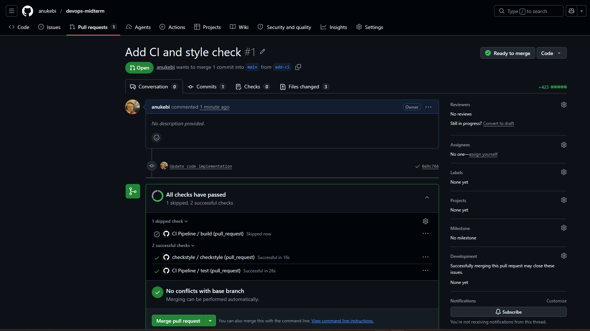

**GitHub Actions workflow steps**

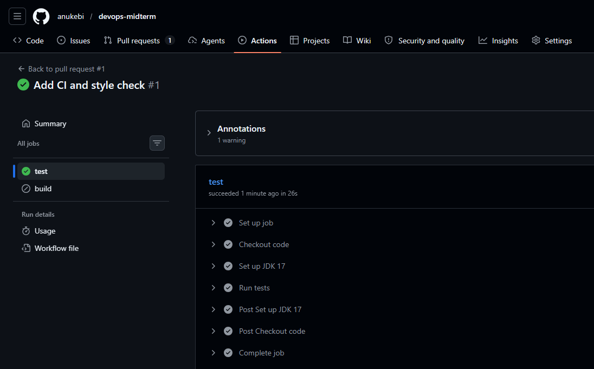

**Successful deployment**

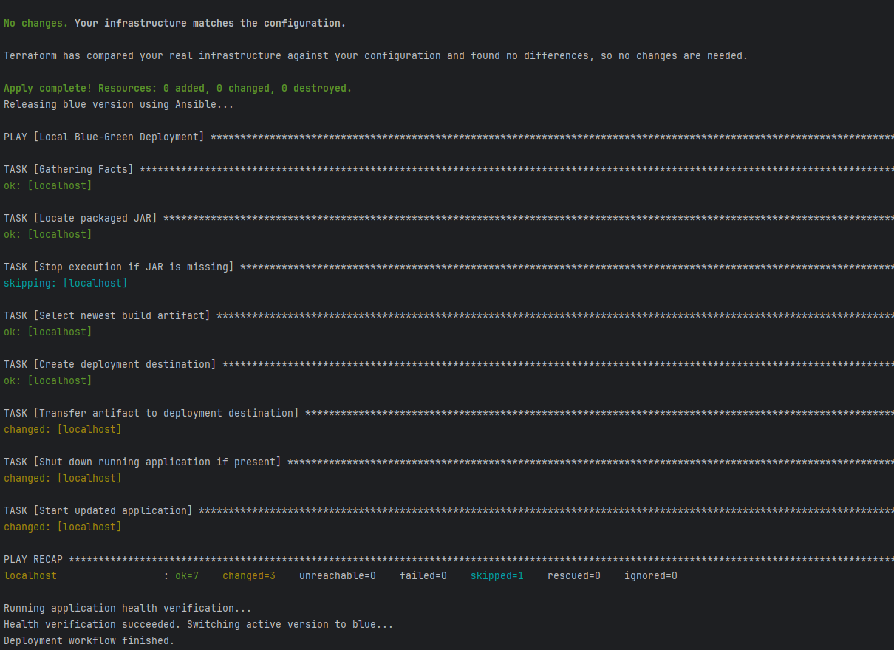

**Failed deployment with rollback**

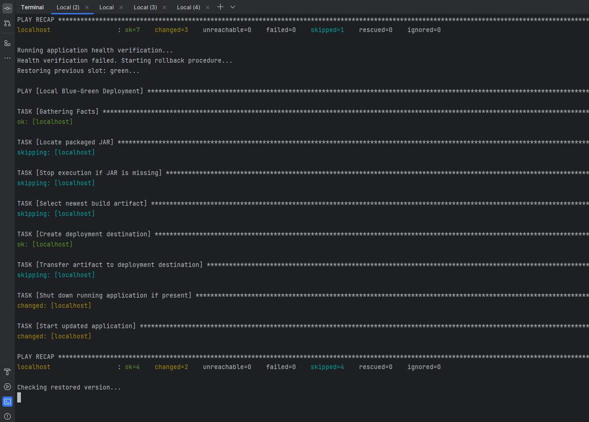

**Application running**

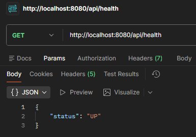
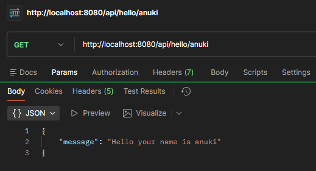
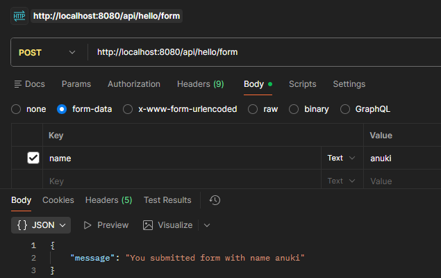

**Health check logs**

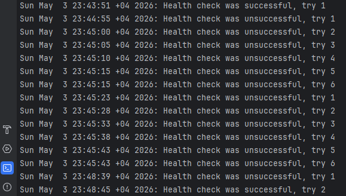

**Application logs**

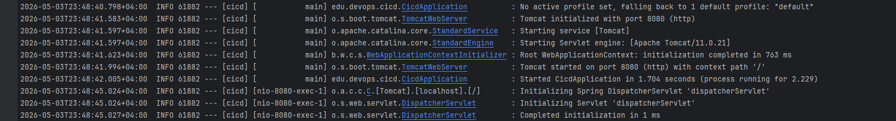

### Observability Stack

**Architecture diagram**

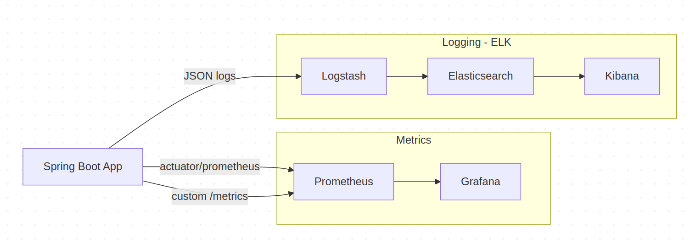

**Kibana - filtered JSON logs**

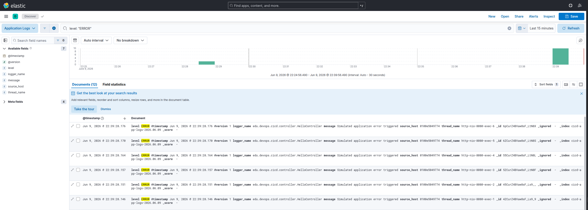

**Grafana - application services**

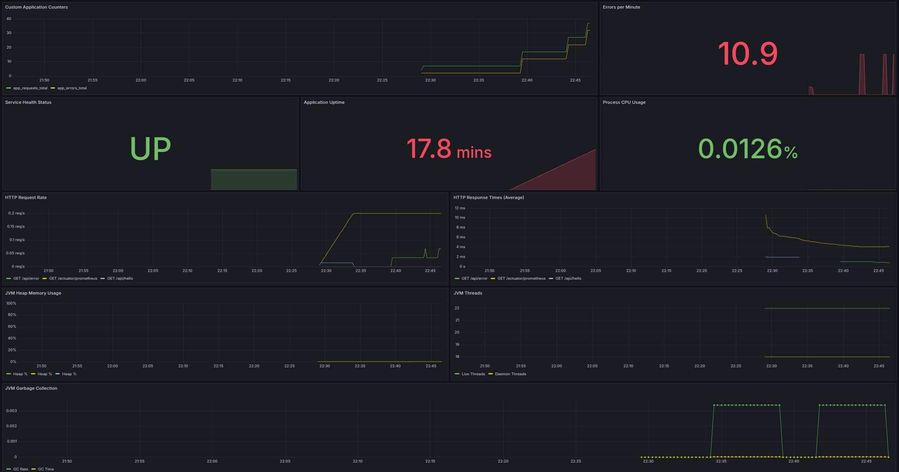

**Grafana - infrastructure**

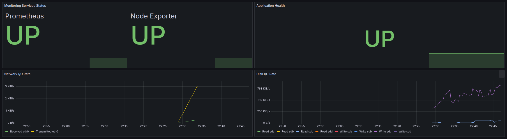

**Grafana - system overview**

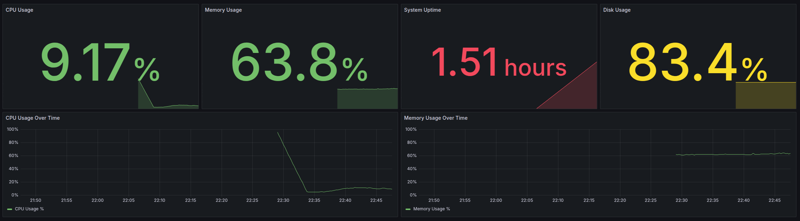

**Grafana - active alert**

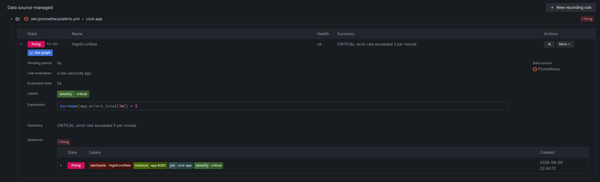

## Project Structure

```
.
├── .github/workflows/       # CI/CD and security pipelines
├── docs/                    # SLO, incident response, observability screenshots
├── imgs/                    # CI/CD pipeline screenshots
├── monitoring/              # Prometheus, Grafana, Logstash configuration
├── pipeline/                # Terraform, Ansible, deploy and healthcheck scripts
├── scripts/                 # setup.sh, validate-environment.sh, post-deploy-check.sh, trigger-alert.sh
├── src/                     # Spring Boot application source
├── Dockerfile
├── docker-compose.yml
└── pom.xml
```

## Analysis

### Why is JSON-structured logging more efficient than plain text logs?

With JSON, every field (`level`, `message`, `@timestamp`, etc.) has a fixed key, so Logstash and Kibana can index and
filter without regex. Plain text requires a separate parser for each log format and breaks when messages contain special
characters.

### Prometheus vs Elasticsearch

Prometheus is a time-series database for numeric metrics ("how many?", "how fast?"). Elasticsearch is a document store
for full log records ("show me all ERROR logs from the last hour"). Prometheus shows error *rate*; Elasticsearch shows
actual error *messages*.

### Long-term log retention

Use Elasticsearch Index Lifecycle Management (ILM) to tier and delete old indices, snapshot to object storage before
deletion, and retain ERROR/WARN logs longer than INFO/DEBUG.
